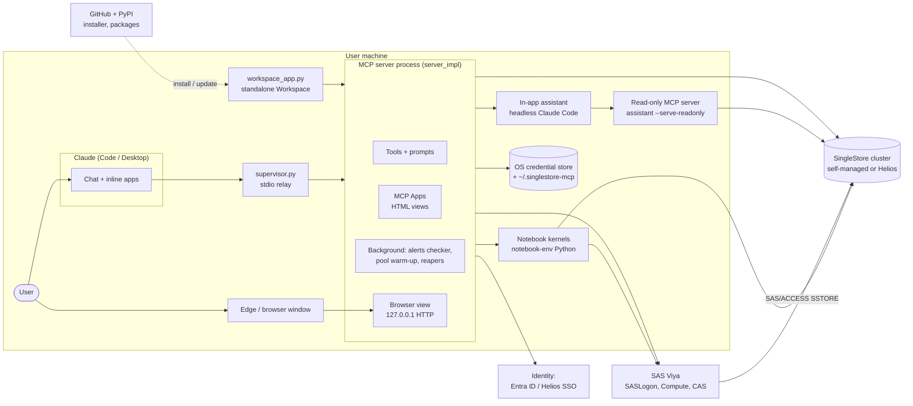
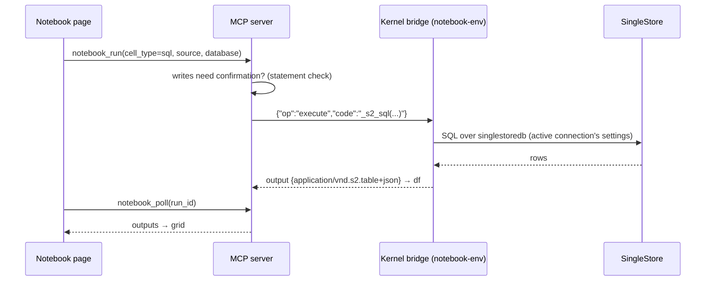
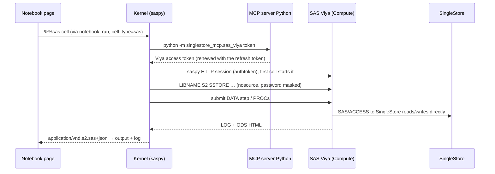
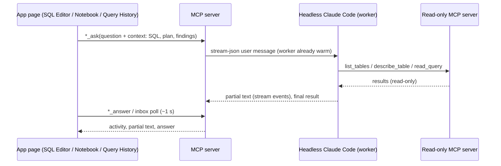
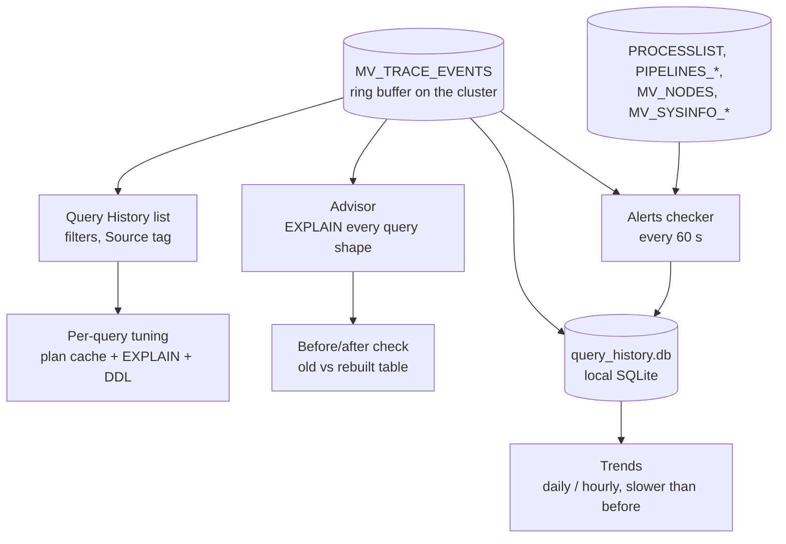

# SingleStore Workspace — architecture

This document describes how the SingleStore MCP server and its **Workspace** are
built, how the parts talk to each other, and how they connect to the systems
around them: SingleStore, Claude, SAS Viya, identity providers and the
operating system. The [README](../README.md) describes what the features do;
this document describes how they work.

## 1. The big picture

One Python package (`singlestore_mcp`) runs in two ways:

- **Inside Claude** (Claude Code, Claude Desktop, VS Code) as an **MCP server**.
  Claude calls its tools and shows its apps (the Workspace, monitors, notebook)
  inline in the chat.
- **On its own** as the **standalone Workspace**: the same apps in a browser
  window (an Edge app window from the desktop shortcut), with no Claude
  needed.

Both run the same code. The apps are HTML pages that talk to the server only
through tool calls, so they work the same in both hosts.



## 2. Processes at run time

| Process | Started by | What it does |
|---|---|---|
| **Supervisor** (`supervisor.py`) | Claude, via `uv run singlestore-mcp-server` | A small stdio relay. It runs the real server as a child and copies JSON-RPC lines between Claude and the child. `restart_server` replaces the child without breaking Claude's connection: it replays `initialize` for older protocol revisions, and with protocol 2026-07-28+ the requests carry their version in `_meta`. |
| **MCP server** (`server_impl.py`) | The supervisor (child), or `workspace_app.py` | All tools, prompts and apps; the connection pool; the background services. |
| **Browser view** (`apps/browser_view.py`) | Inside the server process | A local HTTP server on 127.0.0.1 that serves the apps full-window ("Open in browser"). It forwards the page's tool calls to the server in-process. |
| **Standalone Workspace** (`workspace_app.py`) | The desktop shortcut (`pythonw -m singlestore_mcp.workspace_app`) | Starts the server code and a browser view on port 8790 and opens an Edge app window. It shows a splash page while starting, stops 5 minutes after the last window closes, and restarts itself when the code changes. |
| **Notebook kernel bridge** (`notebook_bridge.py`) | `notebook_kernel.py`, one per open notebook | Runs in a separate Python environment (`~/.singlestore-mcp/notebook-env`) with an IPython kernel. It speaks JSON lines over stdin/stdout (`execute`, `interrupt`, `restart`, outputs). |
| **In-app assistant** (`assistant.py`) | The server, per SQL Editor, notebook or Query History screen | Headless Claude Code (`claude -p --input-format stream-json`), kept running between questions. It answers inside the apps, which also works in the standalone window. |
| **Read-only MCP server** (`assistant --serve-readonly`) | The assistant's Claude Code | Gives the assistant only `list_databases`, `list_tables`, `describe_table` and `read_query` (read-only statements), never write access. |

## 3. Code structure

```
src/singlestore_mcp/
  server.py            entry point (supervisor unless SINGLESTORE_MCP_SUPERVISED / NO_SUPERVISOR)
  supervisor.py        restartable stdio relay
  server_impl.py       MCP server: SQL / pipeline tools, prompts, restart, connections tools
  db.py                connection pool (singlestoredb), retries, JSON fallback, parallel()
  connections.py       saved connections, active one, passwords / tokens, TLS, JWT / SSO / Entra ID
  paths.py             ~/.singlestore-mcp (state folder)

  apps/                MCP Apps: one .py (tools) + one .html (UI) per app
    _core.py           register_app, tool_result, page build (inlines shared.css/js + vendored libraries)
    shared.js/.css     S2 helpers: h(), fmt, callTool, dataTable, fileBrowser, toasts, display modes
    workspace.html     the Workspace shell: rail + views in iframes (an MCP Apps host for its views)
    sql_editor.*       SQL Editor (+ app_page, files, workspace tool `sql_editor`)
    notebook.*         Notebook (SQL / Python / SAS / text cells)
    schema_explorer.*  Schema Explorer + Clean up
    pipeline_monitor.*, cluster_monitor.*, query_grid.*
    query_history.*    Query History: Queries / Trends / Advisor, tuning, in-app Claude
    history_extras.py  Trends + before/after check tools
    alerts.*           Alerts view
    connections.*      Connections + SAS Viya sign-in
    browser_view.py, browser_host.html   "Open in browser" host
    vendor/            ext-apps client bundle, CodeMirror bundle, SingleStore function list

  notebook_kernel.py   kernels: environment setup (uv), start / run / poll / interrupt / restart
  notebook_bridge.py   runs inside the kernel's Python: %%sql, %%sas, conn, SAS helpers
  assistant.py         in-app Claude (workers, profiles, read-only MCP server)
  query_advisor.py     history-wide EXPLAIN analysis -> sort / shard keys, indexes, statistics
  history_store.py     local SQLite copy of the query history (Trends)
  alerts.py            background alert checker and rules
  compare.py           before/after timing of a rebuilt table
  housekeeping.py      scan / drop leftover SAS work tables
  sas_viya.py          SAS Viya settings, OAuth sign-in and tokens
  workspace_app.py     standalone Workspace
  skills/              SKILL.md given to the in-app assistant
claude-skills/         slash-command skills for Claude Code (/singlestore-workspace, …)
scripts/               make_shortcut.py, dev host, CodeMirror bundle build
install.ps1            one-command Windows installer / updater
```

The layering stays simple:

- **Apps never touch the database.** They call tools.
- **Tools never build connections themselves.** They use `db` (the pool), and
  `db` takes the active connection from `connections`.
- **Feature modules** (`query_advisor`, `alerts`, `compare`, `housekeeping`,
  `sas_viya`) are plain Python. Their app modules are thin wrappers that
  register tools.

## 4. How the UI is built

### MCP Apps

Each view is an **MCP App**: an HTML page that Claude renders inline,
following the MCP Apps extension of the official MCP Python SDK.

- `register_app(uri, "file.html")` builds the page once. It expands the
  `<!--S2:HEAD-->` marker into `shared.css`, the vendored
  `@modelcontextprotocol/ext-apps` client and `shared.js`. Pages need no CDN,
  which matters on cluster networks without internet access.
- **Tools come in two kinds:**
  - **Model-visible tools** (e.g. `query_history`, `alerts`) open an app and
    return a text summary for Claude plus `structuredContent` for the page.
  - **App-only tools** (`visibility=APP_ONLY`) are called only by the pages,
    e.g. `query_history_data` or `notebook_run`.
- **Pages** use `S2.callTool(name, args)` and receive JSON. They build their
  DOM with `S2.h()`; no framework is needed. They report what the user is
  looking at with `S2.updateModelContext`, so Claude knows the context.

### The Workspace shell

`workspace.html` is itself an app that **hosts the other apps in iframes**:
SQL, Notebook tabs, Schema, Pipelines, Cluster, History, Alerts and
Connections.

- **It acts as an MCP Apps host for its views.** It answers their
  `ui/initialize`, forwards their `tools/call` to the real host, and passes
  their messages to the chat.
- **It loads view pages through the `app_page` tool, not resource reads.**
  Hosts may cache resources, while tool results are always fresh, so a
  `restart_server` shows new pages at once.
- **Views talk to each other through it** with `postMessage`:
  - `s2-open-view` hands work over, e.g. "Open in SQL Editor" or "Query in
    grid";
  - `s2-connection-changed` reloads the monitors after a connection switch;
  - `s2-alerts-changed` updates the rail badge.

### Running without Claude

`browser_view.py` serves `browser_host.html`, a minimal MCP Apps host, and
the app pages from 127.0.0.1. The host forwards tool calls over HTTP to the
in-process server. The standalone Workspace is this browser view started by
`workspace_app.py` at a fixed address (`~/.singlestore-mcp/workspace.json`
holds its port, token and code fingerprint).

## 5. Main flows

### Running a SQL cell in a notebook



Kernels get the active connection as `SINGLESTORE_*` environment variables.
For token logins (JWT, Helios SSO, Entra ID) they also get a command that
prints a fresh token (`SINGLESTORE_MCP_TOKEN_CMD`), so long-running kernels
survive token expiry.

### Running a SAS cell



**Viya reads SingleStore directly.** SAS uses the `S2` library (SAS/ACCESS,
engine `SSTORE`) and CAS uses a SingleStore-backed caslib. Data never goes
through the notebook's Python on the way into Viya.

### Ask Claude inside an app



### Query History, Advisor and Alerts



The server's own monitoring statements carry `/* s2-… */` markers, so the
history, Advisor and Cluster Monitor leave them out.

## 6. Integrations

### SingleStore

- **Driver:** `singlestoredb` (MySQL wire protocol). It works the same against
  self-managed clusters and Helios.
- **Pool:** `db.py` keeps up to 8 autocommit connections and tracks each
  connection's `USE` and `sql_select_limit`, so they're only re-sent when they
  change. This matters with about 120 ms per round trip.
  - It warms the pool up at start and runs independent queries in parallel.
  - After a dropped connection it discards all idle connections and retries
    on a fresh one.
  - If the driver can't decode a JSON column, a read-only query reruns once
    with JSON left as text.
- **Connections** (`connections.py`): several saved profiles, one of them
  active.
  - **TLS:** a CA file, an optional client certificate and key, and the Helios
    CA bundle download.
  - **Authentication:** password, pasted JWT, Helios browser SSO
    (`singlestoredb.auth`), or **Microsoft Entra ID** through MSAL. Entra ID
    tries the Windows sign-in first (WAM), then the browser. With no app
    registration it uses the Azure CLI public client and the `ossrdbms-aad`
    token.
  - **Tokens** are sent as the password; the server uses
    `mysql_clear_password` over TLS.
- **Cluster features used:**
  - query history (`CREATE EVENT TRACE Query_completion`, `MV_TRACE_EVENTS`);
  - the plan cache (`MV_PLANCACHE`), `EXPLAIN` and `OPTIMIZER_STATISTICS`;
  - pipelines (`PIPELINES*`) and node statistics (`MV_NODES`, `MV_SYSINFO_*`);
  - JWT users through `jwks_endpoint`.

### Claude

- **MCP over stdio** (official MCP Python SDK, MCP Apps extension). The
  supervisor handles both the older handshake protocol and revision
  2026-07-28.
- **Prompts and skills:** MCP prompts (`workspace`, `explain_query`, …), and
  Claude Code skills in `claude-skills/`, which give the slash commands.
- **The in-app assistant** uses the user's own Claude Code login:
  - **speed profiles:** fast (Haiku), balanced (Sonnet) and thorough (Opus);
  - **its tools:** only the read-only MCP server;
  - **its knowledge:** a system prompt plus `skills/singlestore-sql/SKILL.md`.

  Without Claude Code installed, every other feature still works.

### SAS Viya

- **Sign-in** (`sas_viya.py`): OAuth 2.0 Authorization Code + PKCE with Viya's
  built-in public client `vscode`.
  - SAS Logon shows a code that the user pastes once.
  - Tokens are renewed with the refresh token and stored like passwords.
  - An existing sign-in of the SAS Viya MCP server or the SAS Viya CLI is
    reused if this Viya accepts it.
  - The server talks to Viya with Python's built-in HTTP client. If a
    configured proxy refuses the host, it falls back to a direct connection.
- **SAS cells:** `saspy` in HTTP mode with the token, on the chosen compute
  context. Each session gets libref **S2** (SAS/ACCESS to SingleStore, engine
  `SSTORE`) on the notebook's database.
- **Other SAS Python packages** in the notebook environment: `swat` (CAS) via
  `cas_session()`, DLPy (`sas-dlpy`) on top of it, `sasctl` via
  `sasctl_session()`, and `sasoptpy`. All use the same Viya token.

### Operating system and network

- **Secrets:** `keyring` stores them in Windows Credential Manager, macOS
  Keychain or Secret Service. Secrets too large for Credential Manager (Entra
  tokens, MSAL cache) go to an encrypted file whose key stays in the OS store.
  Without an OS store, everything goes to that encrypted file (Fernet).
- **State folder** `~/.singlestore-mcp` (`paths.data_dir()`). It isn't kept in
  `%LOCALAPPDATA%`, because Windows gives the Claude app a private copy of
  that folder.

| File | Content |
|---|---|
| `connections.json` | saved connections (no passwords), the active one |
| `secrets-large.enc` / `secrets.enc` | encrypted large secrets / file-based secret store |
| `notebook-env/` | the notebook kernels' Python environment |
| `query_history.db` | local copy of the query history (Trends) |
| `alerts.json` | alert rules and alert history |
| `cleanup.json`, `cleanup-log.jsonl` | Clean-up patterns and the log of dropped tables |
| `sas.json` | SAS Viya address, compute context, libref |
| `workspace.json`, `starting.html` | the standalone Workspace's address and splash page |
| `assistant/` | the in-app assistant's working folder and MCP config |

- **Network:** the server needs the SingleStore cluster (port 3306, or 3333
  on Helios). Optional: SAS Viya, `login.microsoftonline.com` (Entra ID),
  `portal.singlestore.com` (Helios CA, SSO) and PyPI (notebook packages).

## 7. Security model

- **Credentials** never leave the machine's credential store, except as the
  database login itself. Apps only see `has_password` / token validity.
  Kernels get the password through environment variables, as Jupyter
  connections do. SAS gets the SingleStore password through a non-echoed
  `LIBNAME`, which SAS also masks.
- **Writes need confirmation.** SQL Editor and SQL cells ask before any write.
  The Query Grid, the assistant's server, the Advisor's `EXPLAIN`, the
  before/after check (`SELECT` / `WITH` only, wrapped in `COUNT(*)`) and the
  history views are read-only.
  - **Clean-up drops** require selection plus confirmation, run one table at a
    time, start in dry-run mode, and are logged.
  - **The before/after check** cancels only its own statements, and only after
    checking `PROCESSLIST`.
- **Browser view:** listens on 127.0.0.1 only. Every URL has a random token;
  POSTs must come from the page's own origin with a matching `Host` header
  (against other websites and DNS rebinding). Only app tools are callable.
- **In-app assistant:** Claude Code runs with no built-in tools and only the
  read-only MCP server, so it can inspect but never change data.
- **Viya and Entra tokens** are short-lived and renewed with refresh tokens,
  and are never written to logs or chat.

## 8. Background work

| Task | Where | Cadence |
|---|---|---|
| Pool warm-up | `db.warm` at server start | once, 4 connections in parallel |
| Alerts checker | `alerts.start()` in `run_stdio` and in the standalone app | every 60 s; first check after about 15 s (`SINGLESTORE_MCP_ALERTS=0` turns it off) |
| History sync to SQLite | with the history list and the alerts tick | on use |
| Kernel reaper | `notebook_kernel` | stops kernels after 30 idle minutes |
| Assistant reaper | `assistant` | closes idle Claude workers after 10 minutes |
| Standalone idle stop | `workspace_app` | 5 minutes after the last window closes |

## 9. Build, packaging and release

- **Python 3.12, `uv`:** `pyproject.toml` and `uv.lock`. `uv sync` builds
  `.venv`. Dependencies: `mcp`, `singlestoredb`, `keyring`, `cryptography`,
  `msal`, and `pymsalruntime` on Windows and macOS.
- **The notebook environment** is created separately with `uv venv` and
  `uv pip install` (`notebook_kernel.PACKAGES`), so the server stays light.
- **Front end:** plain HTML/JS, no build step at run time. The CodeMirror
  bundle is prebuilt (`scripts/build_codemirror`), and the ext-apps client is
  vendored.
- **Installer:** `install.ps1` installs uv, the code (git clone or ZIP, or
  `-Source` for offline installs), runs `uv sync --frozen` and creates the
  shortcuts. Options: `-Notebook`, `-WithClaude`, `-Uninstall`.
- **Releases:** the version in `pyproject.toml`, a GitHub release per version
  (`gh release create`). The installer always takes the `master` branch.
- **Development:** `restart_server` reloads code without reconnecting Claude,
  and pages carry a build stamp. `scripts/dev_host.py` runs apps outside
  Claude.

## 10. Adding a view

1. **Server:** `apps/<name>.py` with `register_app(URI, "<name>.html", …)`, a
   model-visible tool that returns `tool_result(with_browser_link(...), data)`,
   and app-only tools for the page.
2. **Page:** `apps/<name>.html` with the `<!--S2:HEAD-->` marker and
   `S2.connect({ onToolResult })`. Get data with `S2.callTool`.
3. **Registration:** add the module to `_APP_MODULES` in `apps/__init__.py`.
4. **Workspace:** add an entry to `VIEWS` (and `ICONS`) in `workspace.html`,
   the name to `WORKSPACE_VIEWS` in `sql_editor.py`, and the `--view` choice in
   `workspace_app.py`.
5. Tag the view's own monitoring SQL with a `/* s2-… */` marker, so it stays
   out of the history.
